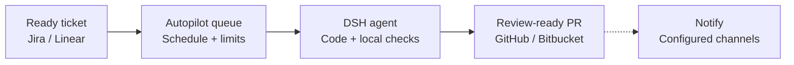

[](LICENSE)
[](https://github.com/canhta/dsh-autopilot/actions/workflows/ci.yml)
[](https://github.com/canhta/dsh-autopilot/issues)
[](https://github.com/deepseek-ai/deepseek-harness)
[](docs/CONTRIBUTING.md)

# dsh-autopilot

dsh-autopilot is an open-source plugin for [DeepSeek Harness](https://github.com/deepseek-ai/deepseek-harness) (DSH). Its goal: move approved tickets from your backlog to review-ready pull requests on your VPS, without supervising every agent turn.

You decide which tickets are ready, when the agent can work and how much it can spend. Autopilot coordinates the work; your repository defines how code is built and checked; people keep control of blockers, review and merge.

> **Pre-release · fixture execution available.** The repository ships a loadable DSH bundle, authenticated tracker ingress, startup and periodic reconciliation, a provider-independent durable admission queue, Jira Cloud and GitHub Issues read adapters, and a fixture-only durable execution path with quiescent pause checkpoints and same-Session continuation. Live-provider execution, pull-request publication and the Web UI are not implemented yet. Follow each implementation slice in [GitHub Issues](https://github.com/canhta/dsh-autopilot/issues).

[Product direction](#product-direction) · [Installation](#installation) · [Local development](#local-development) · [Contributing](#contributing) · [Documentation](docs/README.md)

## Product direction

- **Work from your existing backlog.** The first deployment targets Jira Cloud with GitHub. Provider seams keep later Linear and Bitbucket implementations possible without adding vendor branches to core policy.
- **Control when work starts.** Set a schedule, execution limits and spending policy. Eligible work waits in a durable queue until it can run.
- **Pause without losing the workspace.** Retain the run, DSH Session and Git worktree so interrupted work can continue.
- **Resolve blockers where the task lives.** Receive questions in ticket comments. A human answers and explicitly marks the ticket ready to continue.
- **Stay informed.** Configure ticket comments, webhook or ntfy notifications. Manage runs, schedules, budgets and retained worktrees inside DSH Web.
- **Receive a PR ready for human review.** The agent follows the target repository's instructions and local checks. Autopilot stops at PR creation; it does not merge or manage remote CI.

## How it works



Autopilot selects tickets with the configured ready label and approved Agent Brief, then dispatches eligible work when the schedule, capacity and budget allow. DSH follows the repository's rules in a Git worktree. Creating the verified PR completes the run; notification delivery is independent. Humans own review, merge and marking the ticket Done.

- **Blocked:** questions go into ticket comments. A human must reply and mark the ticket ready before work can continue.
- **Paused:** keep the Session and worktree. Resume rechecks eligibility and execution limits; an operator pause requires explicit resume.

See [run lifecycle](docs/specs/lifecycle.md) for exact pause, recovery and publication rules.

This is an issue-driven AI Development Lifecycle (AIDLC) flow for **one project on one VPS**. Autopilot adds coordination to DSH; it does not replace the harness's agent runtime, tools or Web application. See [product responsibilities](docs/specs/scope.md) for the precise division of ownership.

## Current implementation

The Host bundle currently contributes three independently loadable rows. Its root row exposes provider registry, configuration, admission, reconciliation, authenticated ingress and fixture-dispatch services:

- `dsh-autopilot` registers the public tracker provider registry, admission service and fixture dispatcher. Reconciliation reads normalized provider pages, validates a single versioned Agent Brief, requires current attributable human readiness, checks dependencies, and commits ingress identity plus new queued runs in one bounded DSH storage-domain record.
- `dsh-autopilot/jira` registers the Jira Cloud policy adapter. Exact official Atlassian MCP tools supply candidates, comments and readiness changelogs; Autopilot validates their schemas, bounds every traversal, maps dependencies/priorities/statuses and fails closed when a required tool generation disappears.
- `dsh-autopilot/github-issues` registers the GitHub Issues policy adapter. Exact official GitHub MCP tools supply issues, comments and incoming dependencies. Human-readiness evidence comes from a required `autopilot_read_issue_timeline` extension in the same MCP namespace and authentication context because the official server does not expose the general issue timeline.

Execution is disabled by default. The only accepted execution mode is `fixture`, with absolute target-repository and managed-worktree paths, an explicit base branch, and positive deployment, per-run and reservation token limits. That path atomically claims and reserves one queued run, creates a real managed Git worktree, creates a native DSH root Agent and persisted Session on the hard-coded controlled-model route, accepts one scoped structured terminal report, and settles disjoint provider token categories in the same durable aggregate. A verified report must identify the exact final Git head and porcelain status; a mismatch fails closed. Missing or excessive usage retains the reservation and stops later authorization. A Host restart preserves the identities and marks an interrupted run for explicit recovery instead of dispatching it again.

The same aggregate durably stores the scheduler's `enabled`, `draining`, or `disabled` admission/dequeue gate. Draining lets an already-implementing fixture run settle but starts no more work. The dispatcher-owned disable and active-run stop operations durably mark active work `pausing`, request native Agent cancellation, wait through cancellation-resistant work, flush the Session, inspect Git, dispose the root and only then commit the allocated pause checkpoint. Capacity and the reservation remain held until that checkpoint; missing usage retains an actionable uncertainty reason and stops later authorization. An operator can also hold queued work before any Session or worktree is allocated. Only explicit resume clears an operator hold. Scheduler pauses resume before new work after the current tracker issue, human readiness generation, Agent Brief, scheduler, budget, persisted Session, workspace ownership and exact Git worktree identity are revalidated. Allocated continuation uses DSH's native Session resume path with the same run, Session, worktree and branch, including after Host restart; definite retained-resource mismatches become durable explicit-recovery requirements.

The fixture profile exposes only its scoped `autopilot_report` tool. It masks and denies every Host-global tool, so externally configured delegation cannot create a descendant whose shutdown or token usage escapes the root run. If a required execution service is withdrawn, the dispatcher fences new work, durably requests a `service-withdrawal` pause, quiesces every owned root, and unloads; restoring the service mounts a fresh dispatcher that can resume the same retained run. Tracker reads are likewise fenced after provider withdrawal so a late result cannot mutate admission state. Enabled descendant execution remains unimplemented.

The `dsh-autopilot-jira` Settings namespace requires the Atlassian MCP namespace, Jira Cloud ID, stable numeric project ID, dedicated integration account ID, webhook-secret reference, ready label, traversal bounds, and explicit priority, completed-status, blocking-link, automation-account, and trusted-human-account mappings. Configure the official Atlassian MCP endpoint with its flat `?tools=all` surface so Autopilot can bind the exact read operations. Every traversal verifies `atlassianUserInfo` against the configured integration account. The integration account and configured automation identities can never establish human readiness; automation and trusted-human mappings must be disjoint, and missing dependency or trusted-human mappings fail configuration instead of weakening admission.

The `dsh-autopilot-github-issues` Settings namespace similarly requires the GitHub MCP namespace, one repository owner/name and stable numeric repository ID, integration actor ID, webhook-secret reference, ready label, traversal bounds, priority-label/default rank, completed-state, automation-actor and trusted-human mappings. The MCP server must expose the official `get_me`, `list_issues`, `issue_read` and feature-gated `issue_dependency_read` tools plus the same-auth timeline extension. Every traversal verifies `get_me` against the configured integration actor. Missing, mismatched or incompatible tools keep the provider unavailable.

Outbound Jira and GitHub credentials belong only to their official MCP server configuration. Autopilot has no second API-token/PAT setting or fallback REST client. The provider-specific credential reference is solely for verifying inbound webhook bytes; webhook administration remains a separate operator concern. Linear and Bitbucket will follow the same MCP-first rule when their exact schemas and required policy evidence pass conformance, with only narrow same-auth extensions for capabilities their official servers lack.

Jira identifies Atlassian/customer accounts but cannot prove that an update made with a human account's token was performed interactively by that person. Autopilot therefore treats only explicitly allowlisted Atlassian/customer account IDs as human and every other non-automation actor as unknown. This still relies on a deployment trust rule: trusted-human credentials must never be used by automation, and every automated identity must be listed. Deployments that cannot uphold that rule must not enable admission.

External provider plugins implement the version-2 `TrackerProvider` interface exported by `dsh-autopilot/tracker` and register through `ctx.tracker.register()`. `dsh-autopilot/testing` exports a deterministic fixture adapter for conformance and integration tests. Registration must be effect-owned by the provider plugin; withdrawal aborts and drains active reads and ingress verification before its disposer completes.

The root row reconciles once at startup and then after each configured `reconcileIntervalSeconds` interval; the next interval starts only after the current attempt settles. It also registers the exact Host route `/dsh-autopilot/tracker`. The selected provider authenticates the raw bounded request and returns a provider-qualified delivery identity. Jira requires a secure webhook secret, verifies `X-Hub-Signature`, and uses `X-Atlassian-Webhook-Identifier` to make retries idempotent. A `204` response is sent only after the delivery receipt and any admitted runs commit to the durable aggregate. Failures return bounded HTTP responses and the reconciliation service exposes only sanitized status and aggregate counts.

The default configuration dispatches no model work, and no path writes to Jira or GitHub Issues. The fixture path cannot select a live provider or model. Live Jira Cloud and GitHub Issues support remains unclaimed until each adapter passes authorized synthetic-resource validation. GitHub cannot distinguish a trusted user's manual UI action from automation using that same identity, so deployments must keep trusted-human identities out of automation or leave readiness unknown. Cross-repository GitHub dependency visibility is also unclaimed. Deploy the webhook route only behind operator-managed TLS; the DSH Host web server does not provide TLS itself.

## Installation

The pre-alpha bundle can be installed from a locally packed artifact. It does not yet automate live tickets, so no Jira, GitHub or model credential is required for this verification path; unconfigured provider rows remain unavailable while the Host still boots.

Prerequisites: Git, [Node.js](https://nodejs.org/) 24 or newer, and [pnpm](https://pnpm.io/). DSH itself is invoked from the npm `latest` tag.

```sh
git clone https://github.com/canhta/dsh-autopilot.git
cd dsh-autopilot
pnpm install
mkdir -p .artifacts
pnpm pack --pack-destination .artifacts

npx --yes @deepseek-ai/dsh@latest --profile autopilot --from-default-profile web --dump-config
npx --yes @deepseek-ai/dsh@latest plugin --profile autopilot add ./.artifacts/dsh-autopilot-0.0.0.tgz
npx --yes @deepseek-ai/dsh@latest --profile autopilot --dump-config
npx --yes @deepseek-ai/dsh@latest --profile autopilot --no-open
```

The third DSH command must show a `dsh-autopilot` bundle layer containing the `autopilot`, `autopilot-jira` and `autopilot-github-issues` rows. DSH prints the local Web URL when the final command boots. Omit `DSH_HOME` to use DSH's default profile location, or set it to an operator-owned directory before all four DSH commands to isolate the installation.

For live tracker reads, add one `@deepseek-ai/dsh-mcp-client` row per official server before the matching provider row. Use `serverName: github` for the official GitHub server and `serverName: atlassian` with the Atlassian `?tools=all` endpoint, or change the matching provider setting. Put outbound OAuth/token material only in those MCP rows. The Host tool presentation must be `native` or `both`; DSH intentionally rejects direct Host calls to named tools in `ptc`-only mode. GitHub also requires the `issue_dependencies` toolset and the documented same-auth timeline extension. See [official MCP transport evidence](docs/research/tracker-mcp.md) for the pinned contracts and production gates.

The future connection flow will live in DSH Web Settings. Editing `.env` is not the intended onboarding path; see [operations and configuration](docs/specs/operations.md) for the planned credential ownership model.

## Local development

Install the checkout and run all local gates:

```sh
git clone https://github.com/canhta/dsh-autopilot.git
cd dsh-autopilot
pnpm install
pnpm run hooks:install
pnpm run check
mkdir -p .artifacts
pnpm pack --pack-destination .artifacts
pnpm run verify:package
```

`pnpm run check` runs Biome, strict type checking, the test suite and a clean production build. `pnpm pack` repeats the static gates and builds the distributable tarball. `pnpm run verify:package` installs that artifact into a disposable DSH profile, boots its built Host entry, and proves that package resolution rejects a missing Host entry with the expected diagnostic. Start with the [contributor guide](docs/CONTRIBUTING.md), then use the [documentation map](docs/README.md) to find the relevant specification and source research.

## Contributing

Contributions are welcome: clarify a requirement, verify a DSH integration against source, improve onboarding, or implement an agreed issue. Find or open a [GitHub issue](https://github.com/canhta/dsh-autopilot/issues) before substantial work so scope and dependencies are clear.

See [Contributing](docs/CONTRIBUTING.md) for the local workflow, engineering rules and what to include in a pull request. Keep implementation progress and review evidence on GitHub, not in the specifications.

## License

[MIT](LICENSE). Community project; not an official DeepSeek product.
