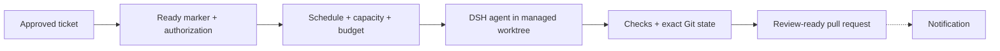

# Autopilot

[](LICENSE)
[](https://github.com/canhta/dsh-autopilot/actions/workflows/ci.yml)
[](https://github.com/canhta/dsh-autopilot/releases)
[](https://github.com/deepseek-ai/deepseek-harness)

Autopilot turns approved tracker work into bounded agent runs and review-ready pull requests inside [DeepSeek Harness](https://github.com/deepseek-ai/deepseek-harness) (DSH).

## What problem it solves

Running a coding agent is easy. Operating one continuously is harder: somebody still has to decide which ticket is ready, track reported token use, limit concurrency, recover interrupted work, publish the exact verified commit and tell the team what happened.

Autopilot adds that operational layer to DSH. It keeps approval, review and merge with humans while automating the work between an approved ticket and a pull request.

It does not replace DSH or vendor integrations. DSH owns the agent runtime, Sessions, credentials and Web shell. Tracker and code-host access reuses official MCP servers and their existing authentication; Autopilot adds only the scheduling, lifecycle and publication behavior that joins them together.

## What it does

- Admits only tickets carrying the configured ready marker and current human authorization.
- Queues work under schedule and concurrency limits, reserving a configured allowance against provider-reported token use.
- Runs the repository's own instructions in a managed Git worktree through DSH.
- Pauses, resumes and cancels without discarding durable run history.
- Recovers interrupted publication, notifications and retained worktrees after restart.
- Revalidates the exact Git state before creating a pull request.
- Shows queue, run details, worktrees, delivery status and settings in DSH Web.
- Stops at pull-request creation; humans still own review, CI decisions and merge.

The contributor test suite verifies the current alpha with controlled providers. Production provider promotion remains gated by [provider conformance](https://github.com/canhta/dsh-autopilot/issues/4). Jira, GitHub Issues and GitHub code hosting are the first adapters; Linear, Bitbucket and later providers use the same provider contracts and MCP-first authentication policy.

The alpha budget fields reserve capacity and reconcile provider-reported usage after requests. They are not an exact cumulative pre-request hard cap; keep native execution disabled for metered production until [the DSH budget boundary](https://github.com/canhta/dsh-autopilot/issues/5) is completed.

## How it works



If the agent needs a decision, Autopilot posts the blocker back to the tracker and waits for an explicit response. A paused run retains its Session and worktree for a checked resume. A cancelled queued or quiescent run stops cleanly while retaining the evidence needed to understand what happened.

Provider failures are isolated from the durable run result. For example, a notification outage cannot undo a completed pull request, and a restart can retry an uncertain publication without creating a duplicate.

## Install

Requires an existing DSH installation.

```sh
dsh plugin --profile web add https://github.com/canhta/dsh-autopilot/releases/download/v0.1.0-alpha.1/canhta-dsh-autopilot-0.1.0-alpha.1.tgz
dsh --profile web
```

Open the URL printed by DSH, then select **Autopilot** in the sidebar.

<details>
<summary>Don't have DSH installed?</summary>

Install its CLI with npm, then run DSH Web once to finish the normal DSH setup:

```sh
npm install --global @deepseek-ai/dsh
dsh web
```

See the [DSH repository](https://github.com/deepseek-ai/deepseek-harness) for its own installation and safety guidance. Autopilot does not manage or upgrade this installation.

</details>

## Configure

Open **Settings → Autopilot** to set the tracker and code-host bindings, schedule, concurrency, budget, notifications and retention policy. Configure the ready marker and provider-specific resource mapping in that provider's linked Settings section.

Fresh installs keep execution disabled. Before enabling it, select the DSH default Agent preset and model, then configure each provider's DSH Settings namespace and official MCP server in the same profile. Keep vendor OAuth, model keys and tokens in DSH Credentials; Autopilot does not create a second authentication flow.

For a systemd-managed VPS installation and backup/restore procedure, see [One-VPS operation](docs/deployment.md).

## Contribute

Start with a [GitHub issue](https://github.com/canhta/dsh-autopilot/issues) so the problem and acceptance criteria are clear. Then run the repository checks before opening a focused pull request:

```sh
git clone https://github.com/canhta/dsh-autopilot.git
cd dsh-autopilot
pnpm install
pnpm run check
```

The full contribution workflow, verification expectations and package checks are in [Contributing](docs/CONTRIBUTING.md).
