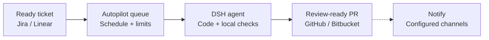

[](LICENSE)
[](https://github.com/canhta/dsh-autopilot/issues)
[](https://github.com/deepseek-ai/deepseek-harness)
[](docs/CONTRIBUTING.md)

# dsh-autopilot

dsh-autopilot is an open-source plugin being built for [DeepSeek Harness](https://github.com/deepseek-ai/deepseek-harness) (DSH). Its goal: move approved tickets from your backlog to review-ready pull requests on your VPS, without supervising every agent turn.

You decide which tickets are ready, when the agent can work and how much it can spend. Autopilot coordinates the work; your repository defines how code is built and checked; people keep control of blockers, review and merge.

> **Pre-release · specifications only.** The design is available; there is no installable plugin yet. The capabilities below describe the intended product, not working features. Follow development in [GitHub Issues](https://github.com/canhta/dsh-autopilot/issues).

[Capabilities](#what-youll-be-able-to-do) · [Installation](#installation) · [Local development](#local-development) · [Contributing](#contributing) · [Documentation](docs/README.md)

## What you'll be able to do

- **Work from your existing backlog.** Select tickets by a configured label and approved brief. Use Jira or Linear with GitHub or Bitbucket; add providers through Cordis plugins.
- **Control when work starts.** Set a schedule, execution limits and spending policy. Eligible work waits in a durable queue until it can run.
- **Pause without losing the workspace.** Retain the run, DSH Session and Git worktree so interrupted work can continue.
- **Resolve blockers where the task lives.** Receive questions in ticket comments. A human answers and explicitly marks the ticket ready to continue.
- **Stay informed.** Configure ticket comments, webhook or ntfy notifications. Manage runs, schedules, budgets and retained worktrees inside DSH Web.
- **Receive a PR ready for human review.** The agent follows the target repository's instructions and local checks. Autopilot stops at PR creation; it does not merge or manage remote CI.

## How it works



Autopilot selects tickets with the configured ready label and approved Agent Brief, then dispatches eligible work when the schedule, capacity and budget allow. DSH follows the repository's rules in a Git worktree. Creating the verified PR completes the run; notification delivery is independent. Humans own review, merge and marking the ticket Done.

- **Blocked:** questions go into ticket comments. A human must reply and mark the ticket ready before work can continue.
- **Paused:** keep the Session and worktree. Resume rechecks eligibility and execution limits; an operator pause requires explicit resume.

See [run lifecycle](docs/specs/lifecycle.md) for exact pause, recovery and publication rules.

This is an issue-driven AI Development Lifecycle (AIDLC) flow for **one project on one VPS**. Autopilot adds coordination to DSH; it does not replace the harness's agent runtime, tools or Web application. See [product responsibilities](docs/specs/scope.md) for the precise division of ownership.

## Installation

An installation command will be published with the first validated plugin release. Cloning this repository does **not** install Autopilot, and installing DSH alone does not add it.

To evaluate the design before a release:

- Read [provider configuration](docs/specs/providers.md) for tracker and code-host choices.
- Read [operations and configuration](docs/specs/operations.md) for scheduling, budgets, credentials, notifications and VPS operation.

These are specifications, not a deployable configuration example.

## Local development

For the current documentation-only repository, you need Git and a Markdown editor:

```sh
git clone https://github.com/canhta/dsh-autopilot.git
cd dsh-autopilot
```

Start with the [contributor guide](docs/CONTRIBUTING.md), then use the [documentation map](docs/README.md) to find the relevant specification and source research.

There is no `package.json`, development server or build/test command yet. Runtime setup and verified commands must accompany the implementation that introduces them; DSH's own development commands are not commands for this repository.

## Contributing

Contributions are welcome: clarify a requirement, verify a DSH integration against source, improve onboarding, or implement an agreed issue. Find or open a [GitHub issue](https://github.com/canhta/dsh-autopilot/issues) before substantial work so scope and dependencies are clear.

See [Contributing](docs/CONTRIBUTING.md) for the local workflow, engineering rules and what to include in a pull request. Keep implementation progress and review evidence on GitHub, not in the specifications.

## License

[MIT](LICENSE). Community project; not an official DeepSeek product.
