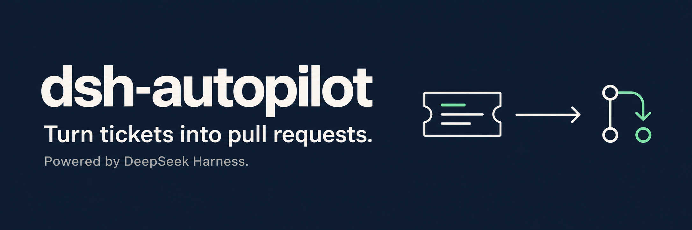
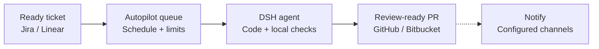

[](LICENSE)
[](https://github.com/canhta/dsh-autopilot/actions/workflows/ci.yml)
[](https://github.com/canhta/dsh-autopilot/issues)
[](https://github.com/deepseek-ai/deepseek-harness)
[](docs/CONTRIBUTING.md)

# dsh-autopilot

dsh-autopilot is an open-source plugin for [DeepSeek Harness](https://github.com/deepseek-ai/deepseek-harness) (DSH). Its goal: move approved tickets from your backlog to review-ready pull requests on your VPS, without supervising every agent turn.

You decide which tickets are ready, when the agent can work and how much it can spend. Autopilot coordinates the work; your repository defines how code is built and checked; people keep control of blockers, review and merge.

> **Pre-release · bootstrap available.** The repository now ships a loadable DSH bundle and its build/test/package workflow. Ticket intake, execution, provider connections and the Web UI are still planned capabilities, not working features. Follow each implementation slice in [GitHub Issues](https://github.com/canhta/dsh-autopilot/issues).

[Product direction](#product-direction) · [Installation](#installation) · [Local development](#local-development) · [Contributing](#contributing) · [Documentation](docs/README.md)

## Product direction

- **Work from your existing backlog.** Select tickets by a configured label and approved brief. Use Jira or Linear with GitHub or Bitbucket; add providers through Cordis plugins.
- **Control when work starts.** Set a schedule, execution limits and spending policy. Eligible work waits in a durable queue until it can run.
- **Pause without losing the workspace.** Retain the run, DSH Session and Git worktree so interrupted work can continue.
- **Resolve blockers where the task lives.** Receive questions in ticket comments. A human answers and explicitly marks the ticket ready to continue.
- **Stay informed.** Configure ticket comments, webhook or ntfy notifications. Manage runs, schedules, budgets and retained worktrees inside DSH Web.
- **Receive a PR ready for human review.** The agent follows the target repository's instructions and local checks. Autopilot stops at PR creation; it does not merge or manage remote CI.

## How it works



Autopilot selects tickets with the configured ready label and approved Agent Brief, then dispatches eligible work when the schedule, capacity and budget allow. DSH follows the repository's rules in a Git worktree. Creating the verified PR completes the run; notification delivery is independent. Humans own review, merge and marking the ticket Done.

- **Blocked:** questions go into ticket comments. A human must reply and mark the ticket ready before work can continue.
- **Paused:** keep the Session and worktree. Resume rechecks eligibility and execution limits; an operator pause requires explicit resume.

See [run lifecycle](docs/specs/lifecycle.md) for exact pause, recovery and publication rules.

This is an issue-driven AI Development Lifecycle (AIDLC) flow for **one project on one VPS**. Autopilot adds coordination to DSH; it does not replace the harness's agent runtime, tools or Web application. See [product responsibilities](docs/specs/scope.md) for the precise division of ownership.

## Installation

The bootstrap can be installed from a locally packed artifact. It does not yet automate tickets, so no Jira, GitHub or model credential is required for this verification path.

Prerequisites: Git, [Node.js](https://nodejs.org/) 24 or newer, and [pnpm](https://pnpm.io/). DSH itself is invoked from the npm `latest` tag.

```sh
git clone https://github.com/canhta/dsh-autopilot.git
cd dsh-autopilot
pnpm install
mkdir -p .artifacts
pnpm pack --pack-destination .artifacts

npx --yes @deepseek-ai/dsh@latest --profile autopilot --from-default-profile web --dump-config
npx --yes @deepseek-ai/dsh@latest plugin --profile autopilot add ./.artifacts/dsh-autopilot-0.0.0.tgz
npx --yes @deepseek-ai/dsh@latest --profile autopilot --dump-config
npx --yes @deepseek-ai/dsh@latest --profile autopilot --no-open
```

The third DSH command must show a `dsh-autopilot` bundle layer containing the `autopilot` row. DSH prints the local Web URL when the final command boots. Omit `DSH_HOME` to use DSH's default profile location, or set it to an operator-owned directory before all four DSH commands to isolate the installation.

The future connection flow will live in DSH Web Settings. Editing `.env` is not the intended onboarding path; see [operations and configuration](docs/specs/operations.md) for the planned credential ownership model.

## Local development

Install the checkout and run all local gates:

```sh
git clone https://github.com/canhta/dsh-autopilot.git
cd dsh-autopilot
pnpm install
pnpm run hooks:install
pnpm run check
mkdir -p .artifacts
pnpm pack --pack-destination .artifacts
pnpm run verify:package
```

`pnpm run check` runs Biome, strict type checking, the test suite and a clean production build. `pnpm pack` repeats the static gates and builds the distributable tarball. `pnpm run verify:package` installs that artifact into a disposable DSH profile, boots its built Host entry, and proves a missing package entry cannot reach readiness. Start with the [contributor guide](docs/CONTRIBUTING.md), then use the [documentation map](docs/README.md) to find the relevant specification and source research.

## Contributing

Contributions are welcome: clarify a requirement, verify a DSH integration against source, improve onboarding, or implement an agreed issue. Find or open a [GitHub issue](https://github.com/canhta/dsh-autopilot/issues) before substantial work so scope and dependencies are clear.

See [Contributing](docs/CONTRIBUTING.md) for the local workflow, engineering rules and what to include in a pull request. Keep implementation progress and review evidence on GitHub, not in the specifications.

## License

[MIT](LICENSE). Community project; not an official DeepSeek product.
